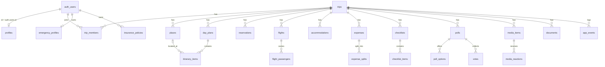

# Data Model & RLS

Source of truth for the Supabase Postgres schema. Trip: Budapest 2026-10-04 → 2026-10-08
(5 day plans). Currencies: HUF (base), ILS, EUR, USD. Magic-link auth over `auth.users`,
extended via `profiles`. Every table gets RLS. Schema changes require updating this doc.

## 1. Conventions

- **PKs**: `id uuid primary key default gen_random_uuid()` — omitted from DDL below except where the PK is special.
- **Timestamps**: all tables have `created_at timestamptz not null default now()`; mutable tables add `updated_at timestamptz`, kept current by the `set_updated_at` trigger (§5) — both omitted from DDL below.
- **All instants are `timestamptz`**; the app renders `Europe/Budapest` (primary) or `Asia/Jerusalem` (secondary). `date` only for trip days / validity dates.
- **Money**: `numeric(12,2)` + `currency char(3)` ISO-4217 (HUF formatted without decimals in UI). Non-HUF amounts also store `amount_base_huf` + `fx_rate_used`.
- **Naming**: `snake_case`, plural tables, `<table>_id` FKs. Deletes cascade from `trips`; `auth.users` deletes cascade to owned rows.
- **Soft delete** only for media (`media_items.status`); everything else hard-deletes.
- **Masked secrets only** in the DB (booking refs, e-ticket serials, policy numbers) — full values live in the user's e-mail/PDF (see `04-security-and-privacy.md`).

## 2. ERD



Remaining FKs (documents ↔ reservations / boarding passes, expense receipts, backup
items, poll option ↔ place, blocked-by) are declared in the DDL below. `exchange_rates`
and `weather_cache` are trip-independent caches (single-city trip).

## 3. Enums

```sql
create extension if not exists citext;
create type member_role        as enum ('owner','member');
create type member_status      as enum ('active','pending','declined');
create type place_type         as enum ('restaurant','bar','cafe','attraction','viewpoint','bath','shopping','other');
create type place_status       as enum ('idea','under_review','approved','scheduled','visited','rejected');
create type itinerary_category as enum ('food','attraction','walk','transit','rest','nightlife','flight','accommodation','other');
create type itinerary_status   as enum ('planned','confirmed','in_progress','completed','skipped','cancelled');
create type reservation_status as enum ('pending','confirmed','cancelled','used');               -- added beyond spec
create type flight_direction   as enum ('outbound','return');
create type flight_status      as enum ('scheduled','boarding','departed','landed','cancelled'); -- added beyond spec
create type expense_category   as enum ('lodging','food','transit','attraction','shopping','nightlife','taxi','other');
create type expense_status     as enum ('draft','confirmed','settled','refunded');
create type split_method       as enum ('equal','exact','percent','shares');
create type fx_rate_type       as enum ('market','card','cash','manual');        -- added beyond spec
create type checklist_scope    as enum ('personal','group','assigned');
create type checklist_priority as enum ('critical','important','normal');        -- added beyond spec
create type checklist_item_status as enum ('not_started','in_progress','done','blocked');
create type poll_status        as enum ('open','closed');
create type quorum_rule        as enum ('majority','unanimous');                 -- added beyond spec
create type media_type         as enum ('image','video');
create type media_visibility   as enum ('group','private');
create type media_status       as enum ('active','deleted');                     -- added beyond spec
create type reaction_kind      as enum ('like','comment');                       -- added beyond spec
create type share_scope        as enum ('private','members','emergency_only');
create type document_type      as enum ('passport','insurance','eticket','booking','other');
create type price_source       as enum ('manual','api');
```

## 4. Tables

### 4.1 Core

```sql
create table public.trips (
  id uuid primary key default gen_random_uuid(),   -- kept: trips is the root of the FK graph
  name text not null,
  city text not null default 'Budapest',
  country text not null default 'HU',
  start_date date not null,  end_date date not null check (end_date >= start_date),
  tz_primary text not null default 'Europe/Budapest',   -- IANA tz where the trip happens
  tz_secondary text not null default 'Asia/Jerusalem',  -- IANA tz, home reference
  base_currency char(3) not null default 'HUF',
  created_by uuid not null references auth.users(id) on delete restrict
);

-- Signup allowlist, pre-seeded with the 5 known emails (docs/09-import-and-seed.md).
create table public.allowed_emails (
  email citext primary key,
  invited_by uuid references auth.users(id) on delete set null
);
-- No client policies: checks run server-side (service role bypasses RLS). Users
-- must never be able to enumerate the allowlist.

create table public.profiles (
  id uuid primary key references auth.users(id) on delete cascade,  -- = auth.users.id
  full_name text not null,  heb_name text,  phone text,  avatar_url text,
  birth_date date,
  citizenships text[] not null default '{IL}'
);
create table public.trip_members (
  trip_id uuid not null references public.trips(id) on delete cascade,
  user_id uuid not null references auth.users(id) on delete cascade,
  role member_role not null default 'member',
  status member_status not null default 'pending',
  sort_order int not null default 0,
  unique (trip_id, user_id)
);
```

### 4.2 Planning

```sql
create table public.places (
  trip_id uuid not null references public.trips(id) on delete cascade,
  name text not null,  google_maps_url text,  url text,  image_url text,
  type place_type not null default 'other',
  est_price numeric(12,2),  price_currency char(3) not null default 'HUF',
  district text,                                   -- e.g. 'VII. kerület'
  opening_hours jsonb,                             -- {"mon":["10:00","18:00"], ...}
  needs_reservation boolean not null default false,
  suggested_by uuid references auth.users(id) on delete set null,
  note text,
  status place_status not null default 'idea',
  last_verified_at timestamptz,                    -- rule 5: no invented prices/times
  price_source price_source not null default 'manual'
);
create table public.day_plans (
  trip_id uuid not null references public.trips(id) on delete cascade,
  day_number int not null check (day_number between 1 and 5),
  date date not null,  title text,  notes text,
  unique (trip_id, day_number)
);
create table public.itinerary_items (
  day_plan_id uuid not null references public.day_plans(id) on delete cascade,
  place_id uuid references public.places(id) on delete set null,
  title text not null,
  category itinerary_category not null default 'other',
  start_time timestamptz not null,                 -- zero-ambiguity rule 4
  end_time timestamptz,  leave_by timestamptz,     -- leave_by = "leave now" hint
  address text,
  est_cost_per_person numeric(12,2),  est_cost_group numeric(12,2),
  currency char(3) not null default 'HUF',
  status itinerary_status not null default 'planned',
  owner_id uuid references auth.users(id) on delete set null,  -- responsible member
  is_required boolean not null default false,      -- flights / hotel check-in
  backup_item_id uuid references public.itinerary_items(id) on delete set null,
  notes text,  sort_order int not null default 0,
  check (end_time is null or end_time > start_time)
);

-- Booking confirmations. ref_masked only; full refs are NOT stored in the MVP
-- (full_ref_encrypted deliberately omitted until a key-management ADR exists).
create table public.reservations (
  trip_id uuid not null references public.trips(id) on delete cascade,
  itinerary_item_id uuid references public.itinerary_items(id) on delete set null,
  provider text not null,  ref_masked text,
  status reservation_status not null default 'pending',
  cost numeric(12,2),  currency char(3) not null default 'HUF',
  document_id uuid   -- FK added in §4.7 (documents is created later)
);
```

### 4.3 Flights & accommodation

```sql
create table public.flights (
  trip_id uuid not null references public.trips(id) on delete cascade,
  direction flight_direction not null,
  airline text not null default 'Arkia',  flight_no text not null,   -- IZ291 / IZ292
  dep_airport text not null,  dep_terminal text,  arr_airport text not null,
  dep_time timestamptz not null,
  arr_time timestamptz,
  arr_time_verified boolean not null default false,  -- never invent times (rule 5)
  booking_ref_masked text,                           -- of reservation 1385•••93
  status flight_status not null default 'scheduled',
  notes text,
  unique (trip_id, direction)
);
create table public.flight_passengers (
  flight_id uuid not null references public.flights(id) on delete cascade,
  member_id uuid not null references auth.users(id) on delete cascade,
  eticket_serial_masked text,  seat text,
  checked_in boolean not null default false,
  boarding_pass_doc_id uuid,   -- FK added in §4.7
  unique (flight_id, member_id)
);
create table public.accommodations (
  trip_id uuid not null references public.trips(id) on delete cascade,
  name text not null,
  address text not null,                            -- NOT NULL: offline-first rule 6
  lat numeric(9,6),  lng numeric(9,6),
  check_in_at timestamptz,  check_out_at timestamptz,
  booking_ref_masked text,
  host_name text,  host_phone text,  host_contact_url text,
  wifi_ssid text,  wifi_password text,              -- semi-sensitive; trip-member RLS only
  access_instructions text,
  total_price numeric(12,2),  currency char(3) not null default 'HUF',
  deposit numeric(12,2),
  paid_by uuid references auth.users(id) on delete set null,
  split_done boolean not null default false,
  nearest_transit_stop text,
  walk_to_deak_min int,                             -- walk minutes to Deák Ferenc tér
  notes text,
  check (check_out_at is null or check_in_at is null or check_out_at > check_in_at)
);
```

### 4.4 Finance

```sql
create table public.expenses (
  trip_id uuid not null references public.trips(id) on delete cascade,
  title text not null,
  category expense_category not null default 'other',
  amount numeric(12,2) not null check (amount > 0),
  currency char(3) not null default 'HUF',
  amount_base_huf numeric(12,2),                    -- required when currency <> 'HUF'
  fx_rate_used numeric,
  spent_at timestamptz not null default now(),
  paid_by uuid not null references auth.users(id) on delete restrict,
  is_personal boolean not null default false,       -- personal: no splits, owner-only visibility
  tip numeric(12,2),  fee numeric(12,2),
  receipt_media_id uuid,                            -- FK added in §4.6 (media_items is later)
  note text,
  status expense_status not null default 'draft',
  day_number int check (day_number between 1 and 5)
);
create table public.expense_splits (
  expense_id uuid not null references public.expenses(id) on delete cascade,
  member_id uuid not null references auth.users(id) on delete restrict,
  method split_method not null,
  share_value numeric,                              -- exact amount | percent | share units
  computed_amount numeric(12,2) not null,           -- HUF share owed to the payer
  unique (expense_id, member_id)
);
-- percent splits must sum to 100 per expense: enforce in app + verify in tests.

create table public.exchange_rates (
  base char(3) not null,  quote char(3) not null,
  rate numeric not null check (rate > 0),
  rate_type fx_rate_type not null default 'market',
  fetched_at timestamptz not null default now(),
  source text not null,                             -- rule 5: no invented data
  check (base <> quote)
);
-- Written only by Edge Functions (service role); read-only for members.
```

### 4.5 Checklists & polls

```sql
create table public.checklists (
  trip_id uuid not null references public.trips(id) on delete cascade,
  title text not null,
  scope checklist_scope not null default 'group',
  owner_id uuid references auth.users(id) on delete cascade,  -- required for personal/assigned
  sort_order int not null default 0
);
create table public.checklist_items (
  checklist_id uuid not null references public.checklists(id) on delete cascade,
  title text not null,  description text,
  assignee_id uuid references auth.users(id) on delete set null,
  due_at timestamptz,
  priority checklist_priority not null default 'normal',
  status checklist_item_status not null default 'not_started',
  blocked_by_id uuid references public.checklist_items(id) on delete set null,
  link text,  sort_order int not null default 0,
  done_by uuid references auth.users(id) on delete set null,
  done_at timestamptz
);
create table public.polls (
  trip_id uuid not null references public.trips(id) on delete cascade,
  question text not null,
  status poll_status not null default 'open',
  deadline timestamptz not null,
  quorum_rule quorum_rule not null default 'majority',
  created_by uuid not null references auth.users(id) on delete restrict,
  decided_option_id uuid,   -- FK added below (circular with poll_options)
  decision_note text
);
create table public.poll_options (
  poll_id uuid not null references public.polls(id) on delete cascade,
  label text not null,
  est_cost numeric(12,2),  currency char(3) not null default 'HUF',
  distance_note text,  time_note text,  availability_note text,
  place_id uuid references public.places(id) on delete set null,
  sort_order int not null default 0,
  unique (id, poll_id)   -- enables the composite FK on votes
);
alter table public.polls add constraint polls_decided_option_fkey
  foreign key (decided_option_id) references public.poll_options(id) on delete set null;

create table public.votes (
  poll_id uuid not null references public.polls(id) on delete cascade,
  option_id uuid not null,
  member_id uuid not null references auth.users(id) on delete cascade,
  unique (poll_id, member_id),                     -- one vote per member per poll
  foreign key (option_id, poll_id) references public.poll_options (id, poll_id)
    on delete cascade   -- option must belong to the voted poll
);
```

### 4.6 Media wall

```sql
create table public.media_items (
  trip_id uuid not null references public.trips(id) on delete cascade,
  uploader_id uuid not null references auth.users(id) on delete cascade,
  storage_path text not null,                       -- trips/{trip_id}/media/{user_id}/{file}
  thumbnail_path text,
  media_type media_type not null,
  capture_time timestamptz,
  uploaded_at timestamptz not null default now(),
  day_number int check (day_number between 1 and 5),
  linked_place_id uuid references public.places(id) on delete set null,
  caption text,
  visibility media_visibility not null default 'group',
  size_bytes bigint,  width int,  height int,
  status media_status not null default 'active'     -- soft delete: hide, keep object
);
create table public.media_reactions (
  media_id uuid not null references public.media_items(id) on delete cascade,
  member_id uuid not null references auth.users(id) on delete cascade,
  kind reaction_kind not null,
  body text,                                        -- null for like; required for comment
  check (kind <> 'comment' or body is not null)
);
create unique index media_reactions_one_like           -- one like per member per media;
  on public.media_reactions (media_id, member_id)      -- multiple comments allowed
  where kind = 'like';

alter table public.expenses add constraint expenses_receipt_fkey
  foreign key (receipt_media_id) references public.media_items(id) on delete set null;
```

### 4.7 Private & system

```sql
create table public.documents (
  trip_id uuid references public.trips(id) on delete cascade,
  owner_id uuid not null references auth.users(id) on delete cascade,
  document_type document_type not null,
  title text not null,
  storage_path text not null,                       -- trips/{trip_id}/documents/{user_id}/{file}
  is_private boolean not null default true          -- passports / insurance always true
);
alter table public.reservations add constraint reservations_document_fkey
  foreign key (document_id) references public.documents(id) on delete set null;
alter table public.flight_passengers add constraint flight_passengers_boarding_pass_fkey
  foreign key (boarding_pass_doc_id) references public.documents(id) on delete set null;

create table public.emergency_profiles (
  user_id uuid not null unique references auth.users(id) on delete cascade,
  allergies text,  medications text,  conditions text,
  blood_type text,                                  -- nullable by design
  ice_name text not null,  ice_phone text not null, -- in-case-of-emergency contact
  visibility share_scope not null default 'emergency_only'
);
create table public.insurance_policies (
  user_id uuid not null references auth.users(id) on delete cascade,
  insurer text not null,
  policy_no_masked text,  emergency_phone text,  valid_until date,
  document_id uuid references public.documents(id) on delete set null,
  user_verified_at timestamptz
);

-- Audit log, incl. every medical-profile view (rule 3).
create table public.app_events (
  trip_id uuid references public.trips(id) on delete cascade,
  actor_id uuid not null references auth.users(id) on delete restrict,
  action text not null,                             -- e.g. 'view.emergency_profile'
  entity text not null,  entity_id uuid,  meta jsonb
);
create table public.weather_cache (                 -- single-city trip: no trip_id
  day date not null,
  temp_min numeric(4,1),  temp_max numeric(4,1),
  precip_prob int check (precip_prob between 0 and 100),
  wind numeric(5,1),  sunset_time timestamptz,
  source text not null,
  unique (day, source)
);
-- exchange_rates and weather_cache: written only by Edge Functions (service role).
```

## 5. Helper functions

```sql
-- SECURITY DEFINER so policy checks bypass RLS on trip_members (no recursion).
create or replace function public.is_trip_member(p_trip uuid)
returns boolean language sql stable security definer set search_path = public as $$
  select exists (select 1 from public.trip_members
                 where trip_id = p_trip and user_id = auth.uid()
                   and status in ('active','pending'));
$$;  -- pending members may READ (needed to accept an invite)

create or replace function public.is_active_trip_member(p_trip uuid)  -- required for WRITES
returns boolean language sql stable security definer set search_path = public as $$
  select exists (select 1 from public.trip_members
                 where trip_id = p_trip and user_id = auth.uid() and status = 'active');
$$;
create or replace function public.is_trip_owner(p_trip uuid)
returns boolean language sql stable security definer set search_path = public as $$
  select exists (select 1 from public.trip_members
                 where trip_id = p_trip and user_id = auth.uid()
                   and role = 'owner' and status = 'active');
$$;
create or replace function public.current_member_id(p_trip uuid)
returns uuid language sql stable security definer set search_path = public as $$
  select id from public.trip_members
  where trip_id = p_trip and user_id = auth.uid() limit 1;
$$;
create or replace function public.set_updated_at()
returns trigger language plpgsql as $$
begin new.updated_at = now(); return new; end $$;

-- Apply set_updated_at to every table that has an updated_at column:
do $$
declare t text;
begin
  for t in select table_name from information_schema.columns
           where table_schema = 'public' and column_name = 'updated_at'
  loop
    execute format('create trigger trg_%s_updated_at before update on public.%I
                    for each row execute function public.set_updated_at()', t, t);
  end loop;
end $$;
```

## 6. Row Level Security

Enable RLS on every table, then create policies. Standard pattern for the fully
trip-scoped tables `places`, `day_plans`, `itinerary_items`, `reservations`, `flights`,
`flight_passengers`, `accommodations`, `checklists`, `checklist_items`, `polls`,
`poll_options`, `votes` (polls/votes: all members read/write per spec):

```sql
do $$ declare t text; begin   -- enable RLS everywhere
  for t in select table_name from information_schema.tables where table_schema = 'public'
  loop execute format('alter table public.%I enable row level security', t); end loop;
end $$;

do $$ declare t text; begin   -- standard 4-policy pattern for trip-scoped tables
  foreach t in array array['places','day_plans','itinerary_items','reservations',
    'flights','flight_passengers','accommodations','checklists','checklist_items',
    'polls','poll_options','votes']
  loop
    execute format('create policy %I on public.%I for select to authenticated
      using (is_trip_member(trip_id));', t || '_select', t);
    execute format('create policy %I on public.%I for insert to authenticated
      with check (is_active_trip_member(trip_id));', t || '_insert', t);
    execute format('create policy %I on public.%I for update to authenticated
      using (is_active_trip_member(trip_id))
      with check (is_active_trip_member(trip_id));', t || '_update', t);
    execute format('create policy %I on public.%I for delete to authenticated
      using (is_trip_owner(trip_id));', t || '_delete', t);
  end loop;
end $$;
```

Table-specific policies (deviations from the standard pattern):

```sql
-- trips: creator inserts; members read; only owner updates.
create policy trips_select on public.trips for select to authenticated using (is_trip_member(id));
create policy trips_insert on public.trips for insert to authenticated with check (created_by = auth.uid());
create policy trips_update on public.trips for update to authenticated
  using (is_trip_owner(id)) with check (is_trip_owner(id));

-- allowed_emails: no client policies at all (service role only) — see §4.1.

-- profiles: self always; co-members of any shared trip see basics (names/avatars).
create policy profiles_select on public.profiles for select to authenticated using (
  id = auth.uid() or exists (select 1 from public.trip_members a
    join public.trip_members b on a.trip_id = b.trip_id
    where a.user_id = auth.uid() and b.user_id = profiles.id));
create policy profiles_update on public.profiles for update to authenticated
  using (id = auth.uid()) with check (id = auth.uid());
-- INSERT happens at signup via auth hook / trigger (service role).

-- trip_members: members see co-members; owner manages; a user updates only their own
-- row (invite accept/decline).
create policy trip_members_select on public.trip_members for select to authenticated
  using (user_id = auth.uid() or is_trip_member(trip_id));
create policy trip_members_insert on public.trip_members for insert to authenticated
  with check (is_trip_owner(trip_id) and status = 'pending');
create policy trip_members_update on public.trip_members for update to authenticated
  using (user_id = auth.uid() or is_trip_owner(trip_id));
create policy trip_members_delete on public.trip_members for delete to authenticated
  using (is_trip_owner(trip_id) or (user_id = auth.uid() and role <> 'owner'));

-- expenses: personal expenses visible ONLY to the payer (rule 3).
create policy expenses_select on public.expenses for select to authenticated
  using (is_trip_member(trip_id) and (not is_personal or paid_by = auth.uid()));
create policy expenses_insert on public.expenses for insert to authenticated
  with check (is_active_trip_member(trip_id) and (not is_personal or paid_by = auth.uid()));
create policy expenses_update on public.expenses for update to authenticated
  using (paid_by = auth.uid() or is_trip_owner(trip_id));
create policy expenses_delete on public.expenses for delete to authenticated
  using (paid_by = auth.uid() or is_trip_owner(trip_id));

-- expense_splits: follow the parent expense's visibility; no splits on personal expenses;
-- immutable once the expense is settled.
create policy expense_splits_select on public.expense_splits for select to authenticated
  using (exists (select 1 from public.expenses e where e.id = expense_id
    and is_trip_member(e.trip_id) and (not e.is_personal or e.paid_by = auth.uid())));
create policy expense_splits_write on public.expense_splits for all to authenticated
  using (exists (select 1 from public.expenses e where e.id = expense_id
    and is_active_trip_member(e.trip_id) and not e.is_personal and e.status <> 'settled'))
  with check (exists (select 1 from public.expenses e where e.id = expense_id
    and is_active_trip_member(e.trip_id) and not e.is_personal and e.status <> 'settled'));

-- exchange_rates / weather_cache: read-only for members; Edge Functions write.
create policy exchange_rates_select on public.exchange_rates for select to authenticated using (true);
create policy weather_cache_select on public.weather_cache for select to authenticated using (true);

-- media: group-visible unless private; only uploader or trip owner deletes.
create policy media_select on public.media_items for select to authenticated
  using (status = 'active' and is_trip_member(trip_id)
         and (visibility = 'group' or uploader_id = auth.uid()));
create policy media_insert on public.media_items for insert to authenticated
  with check (uploader_id = auth.uid() and is_active_trip_member(trip_id));
create policy media_update on public.media_items for update to authenticated
  using (uploader_id = auth.uid());
create policy media_delete on public.media_items for delete to authenticated
  using (uploader_id = auth.uid() or is_trip_owner(trip_id));

create policy media_reactions_select on public.media_reactions for select to authenticated
  using (exists (select 1 from public.media_items m where m.id = media_id
    and m.status = 'active' and is_trip_member(m.trip_id)
    and (m.visibility = 'group' or m.uploader_id = auth.uid())));
create policy media_reactions_insert on public.media_reactions for insert to authenticated
  with check (member_id = auth.uid());
create policy media_reactions_delete on public.media_reactions for delete to authenticated
  using (member_id = auth.uid());

-- emergency_profiles: per visibility scope. 'private' → self only;
-- 'members'/'emergency_only' → co-members of a shared active trip may read, but the UI
-- must render this data ONLY in the emergency card, and every read MUST insert an
-- app_events row (action='view.emergency_profile') — enforce via the
-- get-emergency-profile Edge Function, not direct client reads.
create policy emergency_profiles_select on public.emergency_profiles for select to authenticated
  using (user_id = auth.uid() or (visibility <> 'private' and exists (
    select 1 from public.trip_members a join public.trip_members b on a.trip_id = b.trip_id
    where a.user_id = auth.uid() and b.user_id = emergency_profiles.user_id
      and a.status = 'active' and b.status = 'active')));
create policy emergency_profiles_write on public.emergency_profiles for all to authenticated
  using (user_id = auth.uid()) with check (user_id = auth.uid());

-- insurance policies: owner-only, always.
create policy insurance_select on public.insurance_policies for select to authenticated
  using (user_id = auth.uid());
create policy insurance_write on public.insurance_policies for all to authenticated
  using (user_id = auth.uid()) with check (user_id = auth.uid());

-- documents: private docs owner-only; shared docs trip-visible.
create policy documents_select on public.documents for select to authenticated
  using (owner_id = auth.uid() or (not is_private and trip_id is not null and is_trip_member(trip_id)));
create policy documents_insert on public.documents for insert to authenticated
  with check (owner_id = auth.uid());
create policy documents_update on public.documents for update to authenticated
  using (owner_id = auth.uid());
create policy documents_delete on public.documents for delete to authenticated
  using (owner_id = auth.uid() or is_trip_owner(trip_id));

-- app_events: append-only audit. Anyone authenticated may insert their own events;
-- only the actor or the trip owner reads. No UPDATE/DELETE policies → immutable.
create policy app_events_insert on public.app_events for insert to authenticated
  with check (actor_id = auth.uid());
create policy app_events_select on public.app_events for select to authenticated
  using (actor_id = auth.uid() or is_trip_owner(trip_id));
```

## 7. Storage

Both buckets are **private** (no public buckets, rule 2). Path convention:
`trips/{trip_id}/{media|documents}/{user_id}/{filename}`.

```sql
insert into storage.buckets (id, name, public, file_size_limit, allowed_mime_types) values
  ('trip-media',     'trip-media',     false, 26214400,
   array['image/jpeg','image/png','image/webp','image/heic','video/mp4']),
  ('trip-documents', 'trip-documents', false, 10485760,
   array['application/pdf','image/jpeg','image/png'])
on conflict (id) do update set file_size_limit = excluded.file_size_limit,
                               allowed_mime_types = excluded.allowed_mime_types;

create or replace function public.storage_trip_id(p_path text)
returns uuid language plpgsql stable as $$
declare v text;
begin
  if (storage.foldername(p_path))[1] <> 'trips' then return null; end if;
  v := (storage.foldername(p_path))[2];
  if v !~ '^[0-9a-f]{8}-[0-9a-f]{4}-[0-9a-f]{4}-[0-9a-f]{4}-[0-9a-f]{12}$' then return null; end if;
  return v::uuid;   -- never cast unvalidated text to uuid (throws)
end $$;

create policy storage_insert on storage.objects for insert to authenticated with check (
  bucket_id in ('trip-media','trip-documents') and is_active_trip_member(storage_trip_id(name)));
-- A SELECT policy is REQUIRED for uploads to succeed (Supabase HEADs the object first):
create policy storage_select on storage.objects for select to authenticated using (
  bucket_id in ('trip-media','trip-documents') and is_trip_member(storage_trip_id(name)));
create policy storage_delete on storage.objects for delete to authenticated using (
  bucket_id in ('trip-media','trip-documents')
  and (is_trip_owner(storage_trip_id(name)) or (storage.foldername(name))[3] = auth.uid()::text));
```

Clients never get permanent URLs: generate **signed URLs with a TTL of 1 hour**
(max 24h for boarding passes on the flight day). `trip-documents` is signed-URL-only
and never rendered in shared views (rule 3).

## 8. Views

```sql
-- Net balance per member (HUF): paid minus owed, over confirmed shared expenses.
create or replace view public.v_member_balances as
select tm.trip_id, tm.user_id,
       coalesce(paid.total, 0) - coalesce(owed.total, 0) as net_base_huf
from public.trip_members tm
left join (select trip_id, paid_by, sum(amount_base_huf) total
           from public.expenses
           where not is_personal and status in ('confirmed','settled') group by 1,2) paid
       on paid.trip_id = tm.trip_id and paid.paid_by = tm.user_id
left join (select e.trip_id, s.member_id, sum(s.computed_amount) total
           from public.expense_splits s join public.expenses e on e.id = s.expense_id
           where e.status in ('confirmed','settled') group by 1,2) owed
       on owed.trip_id = tm.trip_id and owed.member_id = tm.user_id;

-- Cost per day (shared, non-refunded expenses).
create or replace view public.v_day_cost as
select trip_id, day_number, sum(amount_base_huf) total_base_huf, count(*) expense_count
from public.expenses
where not is_personal and status <> 'refunded' and day_number is not null
group by 1, 2;
```

`v_settlement_suggestion` cannot be a plain view — expose the greedy min-transfers
algorithm as a function (the client calls it via RPC or an Edge Function wrapper):

```sql
create or replace function public.suggest_settlements(p_trip uuid)
returns table (from_user uuid, to_user uuid, amount_base_huf numeric)
language plpgsql stable security definer set search_path = public as $$
declare
  debtors jsonb; creditors jsonb; d_key text; c_key text; pay numeric;
begin
  if not is_trip_member(p_trip) then raise exception 'not a trip member'; end if;
  select coalesce(jsonb_object_agg(user_id, -net) filter (where net < 0), '{}'::jsonb),
         coalesce(jsonb_object_agg(user_id,  net) filter (where net > 0), '{}'::jsonb)
    into debtors, creditors
  from public.v_member_balances where trip_id = p_trip;
  while debtors <> '{}'::jsonb and creditors <> '{}'::jsonb loop
    select e.key, e.value::numeric into d_key, pay
      from jsonb_each_text(debtors) e order by e.value::numeric desc limit 1;  -- biggest debtor
    select e.key into c_key
      from jsonb_each_text(creditors) e order by e.value::numeric desc limit 1; -- biggest creditor
    pay := least(pay, (creditors ->> c_key)::numeric);
    from_user := d_key::uuid; to_user := c_key::uuid; amount_base_huf := pay;
    return next;
    debtors   := jsonb_set(debtors,   array[d_key], to_jsonb((debtors   ->> d_key)::numeric - pay));
    creditors := jsonb_set(creditors, array[c_key], to_jsonb((creditors ->> c_key)::numeric - pay));
    if (debtors   ->> d_key)::numeric = 0 then debtors   := debtors   - d_key; end if;
    if (creditors ->> c_key)::numeric = 0 then creditors := creditors - c_key; end if;
  end loop;
end $$;
```

Rounding: the app rounds the final transfer to 2 decimals; a ±0.01 residual from
per-split rounding is absorbed by the largest transfer.

## 9. Settlement algorithm

For each member: `net(m) = SUM(expenses where paid_by = m) − SUM(split shares owed by m)`,
over confirmed non-personal expenses, all normalized to HUF (`amount_base_huf` /
`computed_amount`). Greedy matching (repeatedly settle the largest debtor against the
largest creditor) yields at most `n−1` transfers, which is the minimum possible.

Worked example (4 members, all splits `equal`):

| Expense | Paid by | Amount (HUF) | Share each |
|---|---|---|---|
| Apartment | Yakir | 400 | 100 |
| Dinner | Aharon | 200 | 50 |
| Taxi | Yehonatan | 120 | 30 |
| **Total** | | **720** | **180 each** |

| Member | Paid | Owes | Net |
|---|---|---|---|
| Yakir | 400 | 180 | **+220** |
| Aharon | 200 | 180 | **+20** |
| Yehonatan | 120 | 180 | **−60** |
| Bar | 0 | 180 | **−180** |

Minimal transfers (3 = n−1; no debtor/creditor subset matches exactly, so 2 is impossible):

| From | To | Amount |
|---|---|---|
| Bar | Yakir | 180 |
| Yehonatan | Yakir | 40 |
| Yehonatan | Aharon | 20 |

Verify: Yakir +180+40 = +220 ✓ · Aharon +20 ✓ · Yehonatan −40−20 = −60 ✓ · Bar −180 ✓.
The UI shows transfers as suggestions; on confirmation mark the involved expenses
`settled`. Personal expenses never enter the calculation.

## 10. Migration layout

```
supabase/migrations/
  0001_init.sql              extensions, enums, helper functions, updated_at trigger
  0002_core.sql              trips, allowed_emails, profiles, trip_members
  0003_planning.sql          places, day_plans, itinerary_items, reservations
  0004_flights_lodging.sql   flights, flight_passengers, accommodations
  0005_finance.sql           expenses, expense_splits, exchange_rates
  0006_checklists_polls.sql  checklists, checklist_items, polls, poll_options, votes
  0007_media.sql             media_items, media_reactions (+ expenses receipt FK)
  0008_private_system.sql    documents (+ deferred FKs), emergency_profiles,
                             insurance_policies, app_events, weather_cache
  0009_rls.sql               enable RLS + all policies
  0010_storage.sql           buckets, storage_trip_id(), storage policies
  0011_views.sql             v_member_balances, v_day_cost, suggest_settlements
  0012_indexes.sql           indexes from §11
  0013_seed.sql              structural seed (trip, 5 day plans, allowlist)
```

Bulk seed data (members, allowlisted emails, flights IZ291/IZ292, checklist templates)
is defined in `docs/09-import-and-seed.md`; `0013_seed.sql` seeds only structural rows
and leaves per-member data to the import script.

## 11. Required indexes

Beyond PKs and the UNIQUE constraints in the DDL, create:

- `(trip_members user_id)` · `(places trip_id,status)` · `(accommodations trip_id)` · `(reservations trip_id)`
- `(itinerary_items day_plan_id,sort_order)` · `(itinerary_items start_time)` · `(itinerary_items place_id)`
- `(expenses trip_id,spent_at desc)` · `(expenses paid_by)` · `(expense_splits expense_id)` · `(expense_splits member_id)`
- `(exchange_rates base,quote,fetched_at desc)` · `(checklist_items checklist_id,sort_order)` · `(checklist_items assignee_id)`
- `(polls trip_id,status)` · `(poll_options poll_id,sort_order)` · `(flight_passengers flight_id)` · `(flight_passengers member_id)`
- `(media_items trip_id,uploaded_at desc)` · `(media_items uploader_id)` · `(media_reactions media_id)`
- `(documents trip_id,owner_id)` · `(insurance_policies user_id)` · `(app_events trip_id,created_at desc)` · `(app_events entity_id)`

## 12. Open tasks

- [ ] Apply migrations 0001–0013 against project `zgvpchdqudheiohlrrvm` (re-check the publishable-key 401 in `docs/12-troubleshooting.md` first).
- [ ] Test `suggest_settlements` against the §9 worked example (pgTAP or psql script).
- [ ] Verify every RLS policy with pgTAP tests: pending member read-only, personal-expense isolation, owner-only deletes, app_events immutability.
- [ ] Test storage upload end-to-end (missing SELECT policy breaks uploads) and signed-URL TTL behavior.
- [ ] Ship the `get-emergency-profile` Edge Function that writes the `app_events` audit row; then consider revoking direct SELECT on `emergency_profiles` from `authenticated`.
- [ ] Seed `allowed_emails` with the 5 emails from `docs/09-import-and-seed.md` (Yakir owner; Roei pending) and the trip + 5 day plans + flights IZ291/IZ292.
- [ ] Add app-level validation: percent splits sum to 100; split members ⊆ active trip members.
- [ ] Decide post-MVP approach for full booking references (encrypted column + key-management ADR) — masked-only for now (§4.2).
- [ ] Confirm `tz_primary = Europe/Budapest` semantics with the group before building the Today dashboard clock.

## 13. Reconciliation additions (2026-09-11)

Implemented in `supabase/migrations/0001–0013` + `supabase/seed.sql`; encodes every
BUILD_STATUS audit resolution (C1–C10) and the feature-driven schema-gap list. Deviations
from the §3/§4/§6 DDL above, consolidated:

**Enums** — added: `accommodation_status ('candidate','favorite','booked','rejected')`,
`transit_anchor_role ('central','accommodation','airport_100e','night_meeting')`,
`safety_notice_status ('active','returned','expired')`. Extended: `place_type` +=
`airport,transit_hub,bus_stop,emergency,meeting_point`; `media_status` +=
`pending,needs_conversion,ready,failed` (compression pipeline).

**Tables/columns**
- `trips.created_by` NULLABLE, `on delete set null` (C1; seed precedes first user; owner claims via trigger).
- `allowed_emails` += `display_name, role, member_status, ticket_serial_masked` (drives signup triggers; doc 09 `note` rejected).
- `trip_members` += `active_from date`.
- `places` += `lat, lng, gmaps_place_id, tags text[], source`.
- NEW `day_notes`, `note_reactions` (Today feed; created in 0003; `note_reactions` reuses `reaction_kind`).
- `itinerary_items` += `duration_min, travel_min_to_next, poll_id` (FK → polls, added in 0006).
- `flights` += `source, last_verified_at`; `flight_passengers` += `checkin_done_at, addons jsonb` (passengers NOT seeded — created at signup, C2).
- `accommodations` += `status accommodation_status default 'candidate'`; `address` now nullable with `CHECK (status <> 'booked' OR address IS NOT NULL)` (C10); += `beds, url, platform, door_code, floor_label, apartment_label, intercom, late_checkin_notes, tourist_tax_pct, tourist_tax_verified_at`.
- `expenses` += `settled_amount, settled_currency, payment_method`; `exchange_rates` += `is_override` (C9).
- NEW `budget_caps` (scope `day|category`, owner-only writes).
- `checklist_items` += `type, reminder_offset_minutes, attachment_path, created_by`; NEW `checklist_item_blocks (item_id, blocked_by_item_id)` composite PK + `check (item_id <> blocked_by_item_id)`; `blocked_by_id` kept (C5).
- `polls` += `anonymous_until_close, closed_at, closed_reason, winner_item_id (→ itinerary_items), overridden_by`; `poll_options` += `travel_min, time_needed_min, availability_note, source, last_verified_at`.
- `media_items` += `sha256, tagged_member_ids uuid[], original_path, mime_original, mime_stored (default 'image/webp'), bytes_original, is_moment_of_day` + partial unique index `media_items_one_moment_per_day (trip_id, day_number) WHERE is_moment_of_day`.
- `documents` += `mime, bytes`; `emergency_profiles` allergies/medications/conditions stored as `jsonb`.
- `weather_cache` += `fetched_at` (C8). NEW `transit_tickets, transit_anchor_stations, transit_favorite_lines, preferred_routes, emergency_contacts, safety_notices`.
- All tables get explicit `id uuid PK` per §1 (join tables excepted where composite PK is declared).

**RLS adaptations (§6)**
- Helper functions qualify `auth.uid()` — the functions' fixed `set search_path = public` would otherwise hide the `auth` schema (§5 sketch bug).
- §6's standard loop is corrected to tables that actually carry `trip_id`; `itinerary_items`, `flight_passengers`, `checklist_items`, `poll_options` (no `trip_id` — membership flows through `day_plans`/`flights`/`checklists`/`polls`) use parent-visibility policies (media_reactions/expense_splits pattern).
- `votes` carries denormalized `trip_id` with explicit own-vote-only policies + cross-check `votes.trip_id = polls.trip_id` (prevents cross-trip vote injection; poll-feature rule "member writes only own vote"). `note_reactions` and `checklist_item_blocks` are parent-based.
- `budget_caps`: members read, owner-only writes. `safety_notices`: members read; own insert/update/delete.
- Checklist scope-level permission matrix (doc 06: personal owner-only, assigned assignee-only toggles) is enforced app-layer for MVP — standard 4-policy pattern applies at DB level. Flagged as hardening task.
- Migration layout: §10's `0013_seed.sql` split into `0013_auth_triggers.sql` (allowlist + `handle_new_user` + realtime publication) and `0014_seed_structural.sql` (trip + allowlist + day plans); the full seed lives in `supabase/seed.sql` and is mirrored as `0015_seed_bulk.sql` (idempotent) so `supabase db push` applies it.

**Views/functions (§8)**
- `v_member_balances`, `v_day_cost` created `WITH (security_invoker = on)` — required on Postgres 15 so underlying RLS applies to callers (else any authenticated user could read every trip through view-owner privileges).
- Added `close_expired_polls()` (docs/06-features/09 rule 5: lazy reconcile + cron sweep; abstentions never block; tie/zero-votes → `decided_option_id` null; anonymous callers rejected, service role (no JWT) allowed).

**Storage (§7)**
- `trip-media` allows image mime types only (`video/mp4` removed — photos-only trip, doc 07) and carries a migration-time assertion that both buckets are private (T4).

**Auth triggers (docs/04 §2, docs/09)**
- `enforce_allowed_email` BEFORE INSERT on `auth.users` (T7); `handle_new_user` AFTER INSERT: creates `profiles` (name from `allowed_emails.display_name`), `trip_members` (role/status from allowlist), `flight_passengers` for both flights with masked serial (C2/C3), and claims `trips.created_by` for the first allowlisted owner (C1). All idempotent (`on conflict do nothing`).
